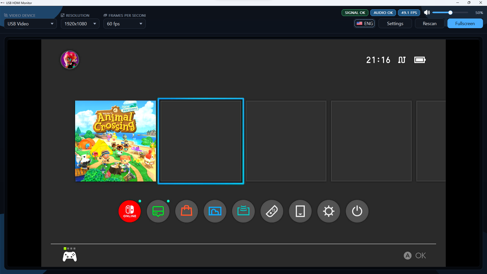
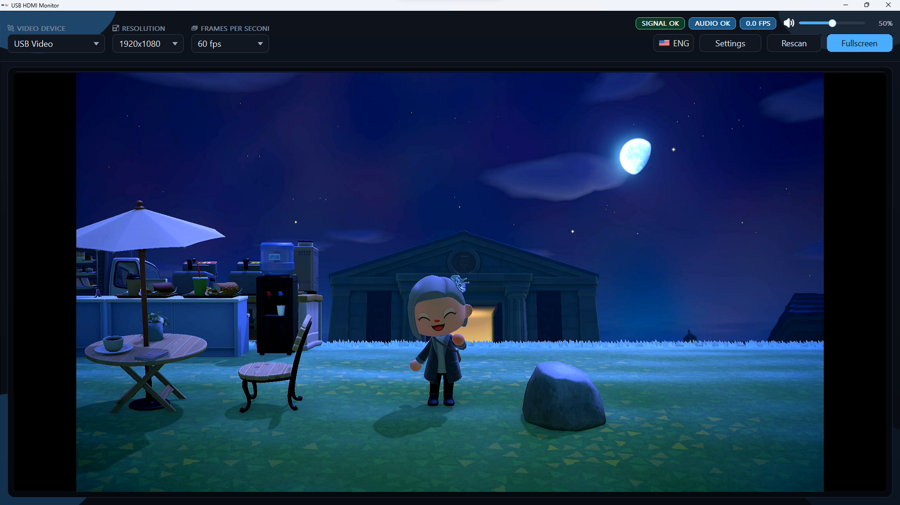
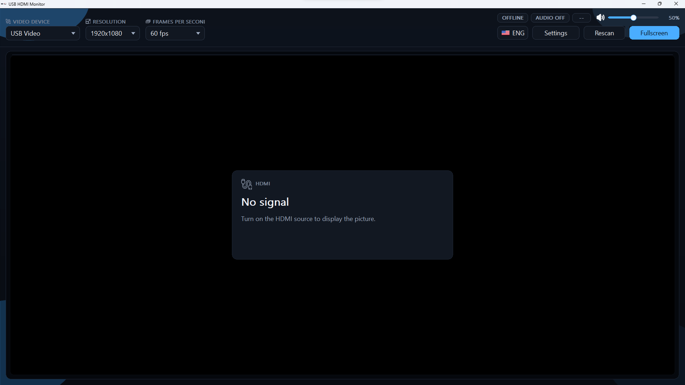
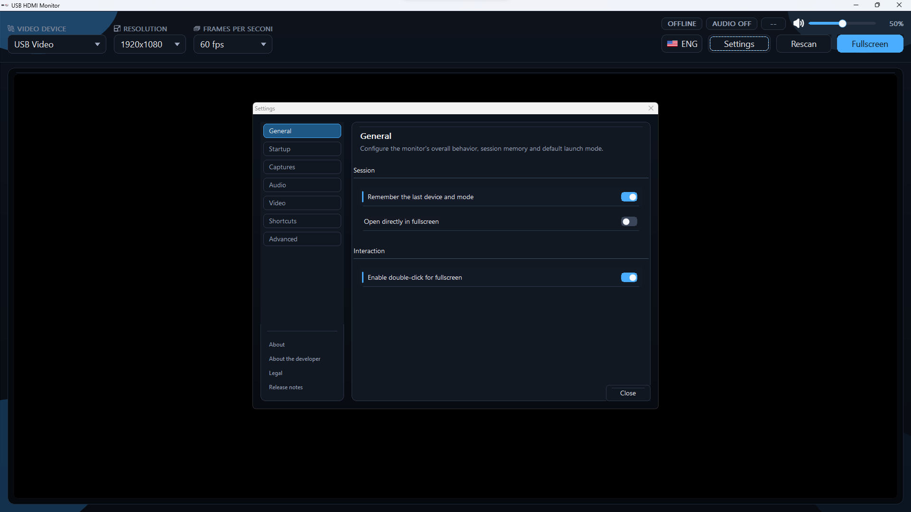
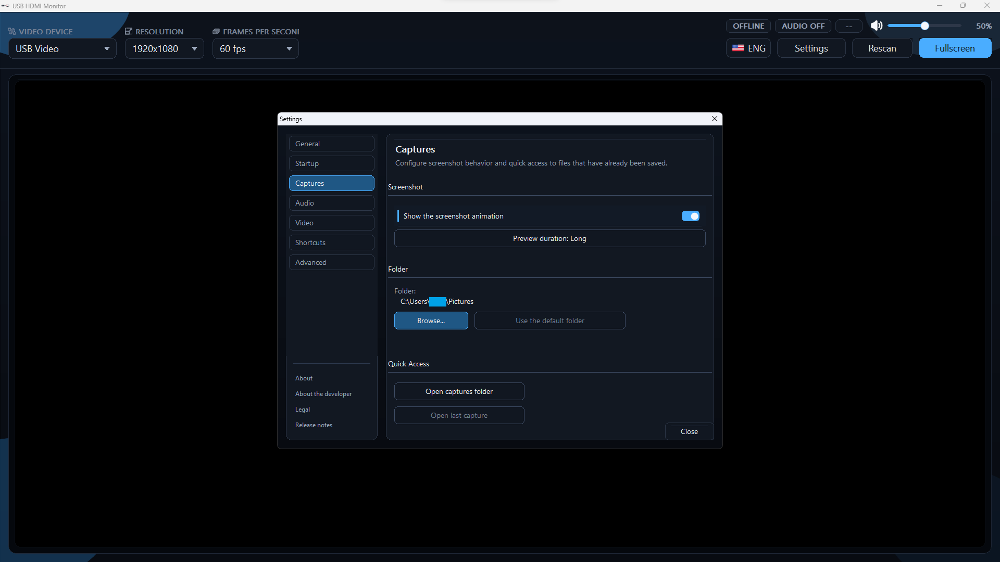
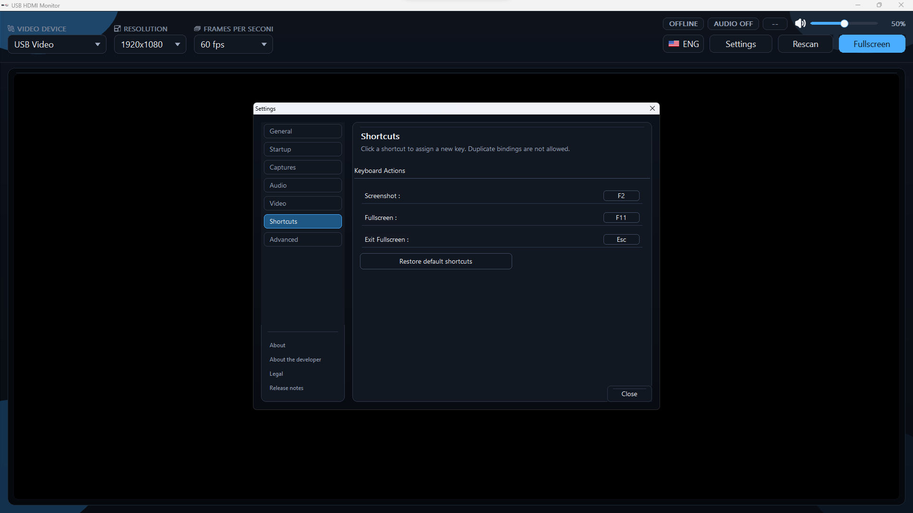

# USB HDMI Monitor

USB HDMI Monitor est un moniteur Windows natif et léger pour les adaptateurs de capture USB HDMI.

Il a été conçu pour les utilisateurs qui veulent afficher une console ou une autre source HDMI sur un PC sans la lourdeur d'OBS lorsqu'ils n'ont pas besoin de streaming ni de gestion de scènes.

Ce dépôt public est la vitrine produit de USB HDMI Monitor :
- binaires de release
- captures d'écran et médias
- notes de version et documentation

Le code source de l'application est maintenu séparément dans un dépôt privé.

## Captures

### Aperçu HDMI

Vue principale avec source active :

Vue principale en jeu :

Vue principale sans signal HDMI :

### Paramètres

Paramètres généraux :

Paramètres de capture :

Paramètres de raccourcis :

## Pourquoi l'utiliser

- Plus rapide et plus simple qu'une suite de diffusion complète
- Aperçu HDMI à faible friction pour les dongles de capture USB UVC
- Mode plein écran avec upscale GPU local
- Monitoring audio automatique lorsque Windows expose un périphérique audio correspondant
- Capture d'écran avec aperçu
- Enregistrement manuel simple et Instant Replay
- Watcher de démarrage optionnel pour la détection automatique de source

## Idéal Pour

- Les joueurs console qui utilisent un dongle de capture USB HDMI bon marché comme écran logiciel
- Les utilisateurs qui veulent une visionneuse HDMI propre sur PC
- Les personnes qui n'ont pas besoin de scènes OBS, de configuration de streaming ou d'un workflow de production complet

## Téléchargement

Dernière release publique :
- [`USB HDMI Monitor Releases`](https://github.com/Azashiin/USBHDMIMonitor/releases)

Téléchargement direct :
- [`USBHDMIMonitor-Setup-v1.51.0.exe`](https://github.com/Azashiin/USBHDMIMonitor/releases/download/v1.51.0/USBHDMIMonitor-Setup-v1.51.0.exe)

Toutes les futures versions seront publiées via la page `Releases` du dépôt :
- [`Releases`](https://github.com/Azashiin/USBHDMIMonitor/releases)

## Matériel Testé

USB HDMI Monitor est principalement conçu et testé autour d'adaptateurs de capture HDMI USB UVC.

Important :
- la compatibilité dépend de ce que le périphérique de capture, la liaison USB et la source HDMI exposent réellement
- ce projet n'est pas positionné comme une solution universelle de capture broadcast professionnelle
- ce projet n'est affilié à aucun fabricant de dongle de capture

## Fonctionnalités Actuelles

- sélection du périphérique, de la résolution et de la fréquence d'images
- mode moniteur plein écran
- contrôle du volume audio
- capture d'écran
- enregistrement manuel
- Instant Replay
- raccourcis configurables
- fenêtre de paramètres
- intégration zone de notification et watcher de démarrage

## Notes de Version

- [Changelog anglais](./CHANGELOG.md)
- [Changelog français](./CHANGELOG_FR.md)

## État du Projet

Ce dépôt public ne contient volontairement pas le code source de l'application.

Il existe pour :
- présenter le projet publiquement
- distribuer les builds
- fournir des captures d'écran et notes de release

## Licence Et Distribution

Voir [`LICENSE.txt`](./LICENSE.txt).
